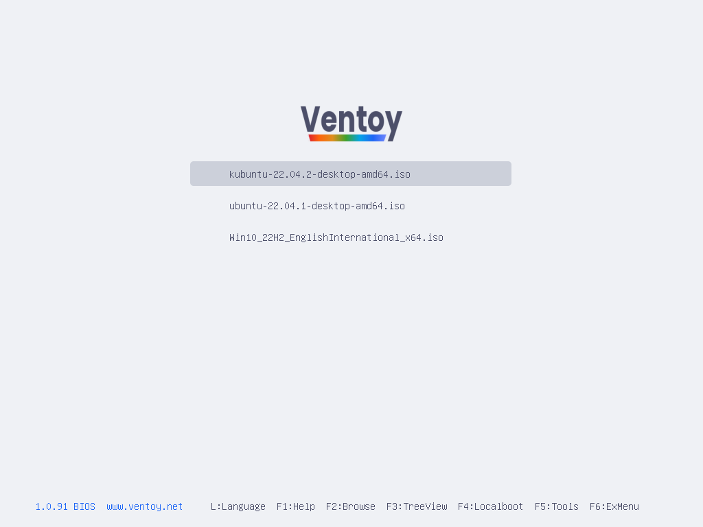
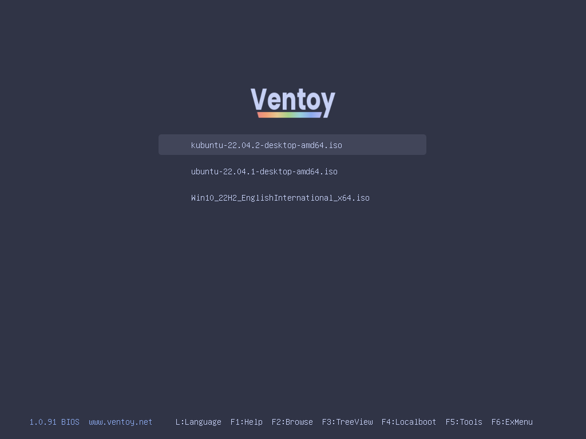
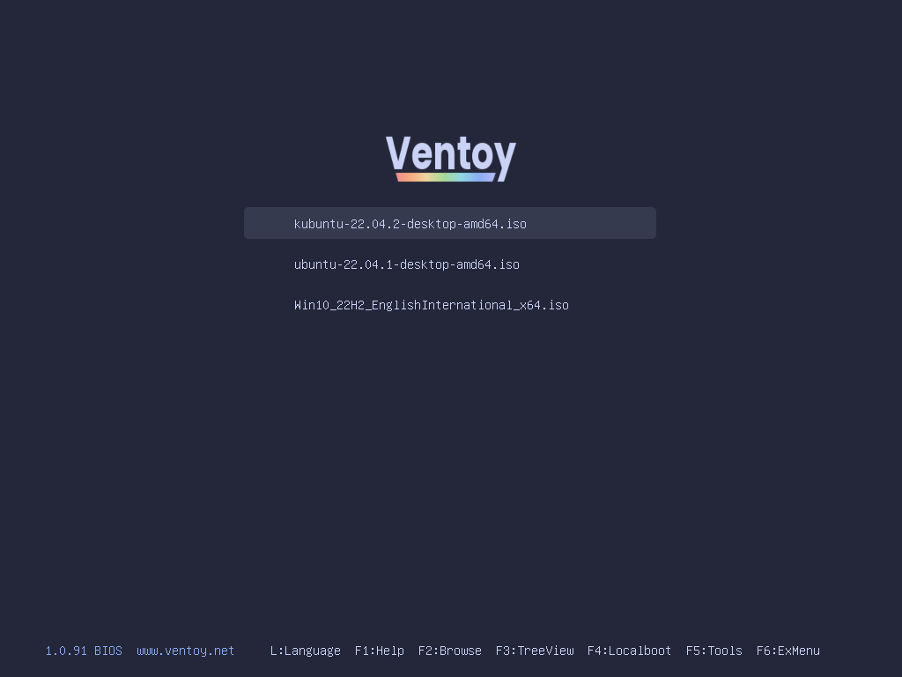
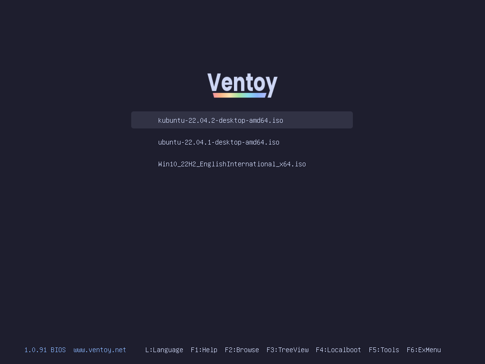

<h3 align="center">
   
  
  Catppuccin for <a href="https://www.ventoy.net/en/index.html">Ventoy</a>
  
</h3>

## Previews

🌻 Latte

  

🪴 Frappé

  

🌺 Macchiato

  

🌿 Mocha

  

## Usage

**1.** Clone this repository locally

**2.** Open chosen flavor folder

**3. (Optional)** Edit `catpuccin-<flavour>/theme.txt` to use unscaled logo. Default resolution is 1024x768 and the logo is scaled to look better on 16:9 monitors. You may also delete unused logo.

**4.** Copy `catpuccin-<flavour>` folder into `ventoy` folder on your ventoy drive. 

**5.** Use [VentoyPlugson](https://www.ventoy.net/en/plugin_plugson.html) to add theme and font, or copy `ventoy.json` into `ventoy` folder on your ventoy drive.

## Acknowledgement

Logo font is [Poppins](https://fonts.google.com/specimen/Poppins).

This themes are based on [Catppuccin for Grub](https://github.com/catppuccin/grub) and [Ventoy Purple Theme](https://github.com/odiegoduarte/ventoy-purple-theme)
