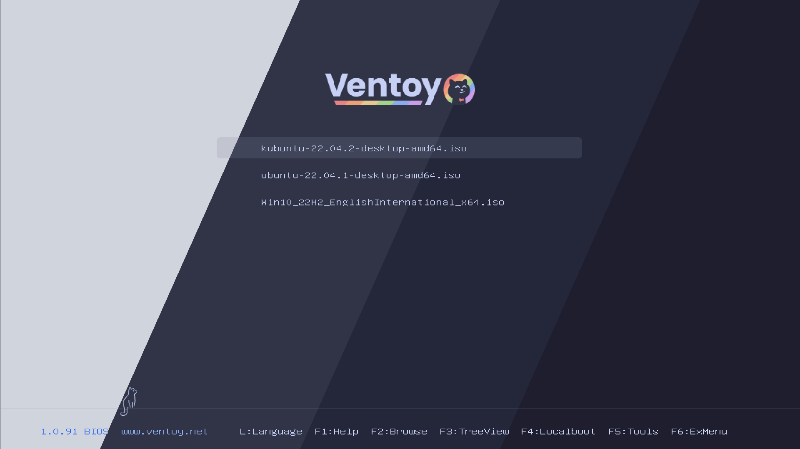
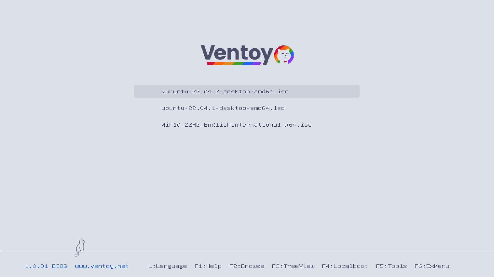
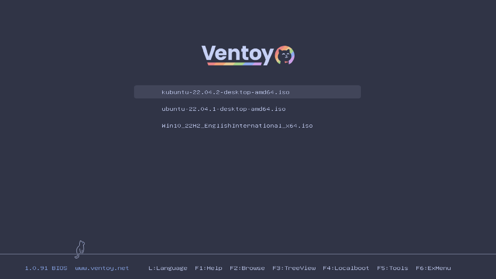
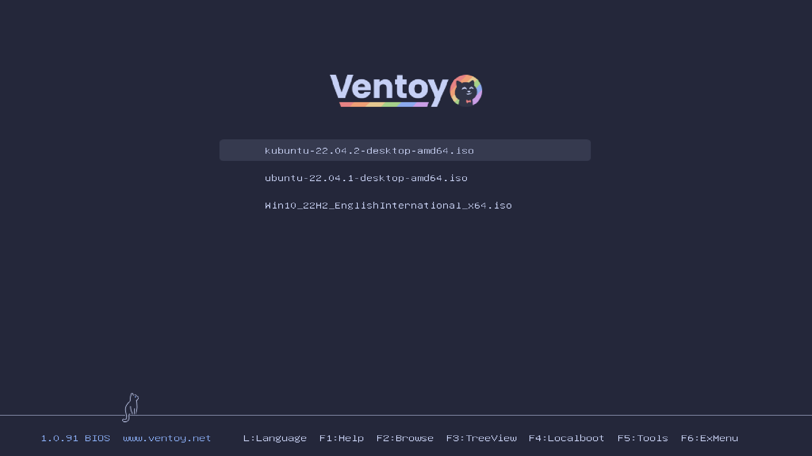
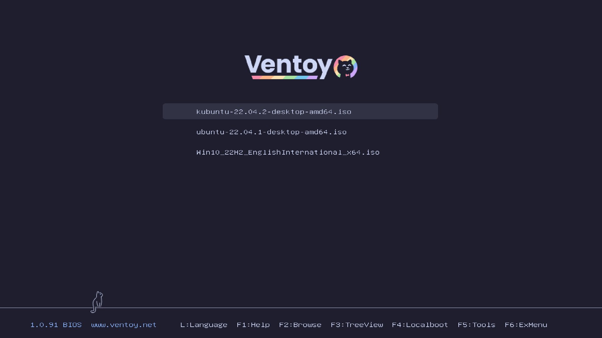

<h3 align="center">
   
  
  Catppuccin for <a href="https://www.ventoy.net/en/index.html">Ventoy</a>
  
</h3>

## Description
 
This is a Ventoy theme using Catppucin palette. The theme is configured for Ventoy's default 1024x768 resolution, viewed on 16:9 screen.

## Previews
Previews are captured in VM and scaled from 1024x768 to 1920x1080 in Gimp. Text looks strange when scaled this way. On my monitor native scaling results in a much better text, but neither do I know how to reproduce it syntheticaly, nor am I sure that you will have similar results.

🌻 Latte

  

🪴 Frappé

  

🌺 Macchiato

  

🌿 Mocha

  

## Usage

**1.** Clone this repository locally

**2.** Open chosen flavor folder

**3.** Copy `catpuccin-<flavour>` folder into `ventoy` folder on your ventoy drive. 

**4.** Copy `ventoy.json` into `ventoy` folder on your drive or merge with an existing file.

## Modification

If you want to modify this is how I've exported images:

To prevent weird anti-aliasing artifacts when exporting main logos from Inkscape I've exported logos in high resolution and scaled down in Gimp.
Footers were also edited in Gimp to make the line the little cat sits on pixel perfect.

## Acknowledgement

Logo font is [Poppins](https://fonts.google.com/specimen/Poppins).

These themes are based on [Catppuccin for Grub](https://github.com/catppuccin/grub) and [Ventoy Purple Theme](https://github.com/odiegoduarte/ventoy-purple-theme)
